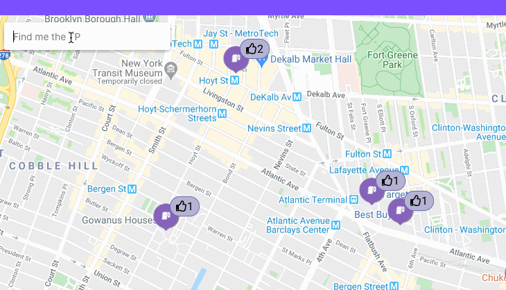
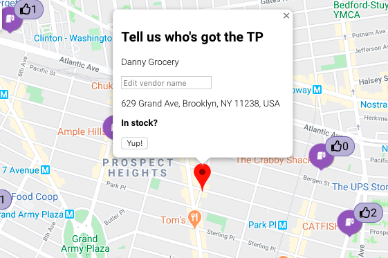
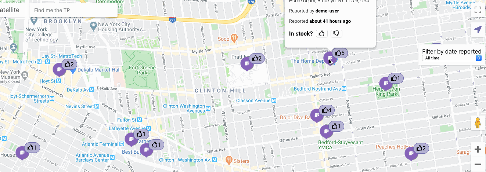

# InStock

[Live](https://nstockapp.herokuapp.com/)

## Overview

InStock is an application that lets users determine whether their local stores have certain items in stock. The problem InStock seeks to address is that many small stores do not have sophisticated POI systems that allow customers to see their stock remotely. Instead, customers must physically visit the store to see if what they want is in stock. 

InStock remedies this problem by crowdsourcing data: after a user submits a report of an item being in stock at a particular location, other users can confirm or deny that the item is, in fact, in stock. Each kind of item has a unique icon for its marker which has a badge indicating how many people have confirmed the report. Users can also filter the results by how recently they were made.

Users can deduce the validity of the report based on how recently they were made and the number of confirmations.

### Features
When a user enters either a place or an address in the search bar, they will receive either an existing report or a blank marker at the coordinates that they searched.



If the searched coordinates do not have an active report, and the user is logged in, they will also see a simple form with the place's contact information and a button that allows them to create a new report of an item being in stock.



To find the most relevant results, a user can see badges indicating the number of people who have confirmed that an item is in stock and can also filter by the date on which reports were made.



## Technologies

InStock is built with the MERN stack (MongoDB, Express, React and Node.js). Frontend state is handled with Redux. Maps are handled with the Google Maps Javascript API via the [React Google Maps Library](https://tomchentw.github.io/react-google-maps/).

## Group Members
* Technical Project Manager/Flex - Jared Kaneshiro
* Frontend - Taylor Wofford
* Backend - Solomon Manyaga
* Google Maps API Integration - Ben Hsieh

## Code Snippets / Learnings
### Implementing the React Google Maps Library
This library is a wrapper for the [Google Maps JavaScript APIv3](https://developers.google.com/maps/documentation/javascript/tutorial). It allowed us to quickly create components for our map, but we eventually encountered uses cases were not described in the user documentation. A few of those challenges and solutions are described below.

### Creating reports from clicked points on the map
We were inspired by the simplicity of the Waze app and wanted our app to allow users to quickly report what's in stock without spending a ton of time filling out details on a form.

Our initial approach was to geocode a marker on the map wherever a user clicked on an unmarked point. Clicking would assign the `selectedCoords` slice of the `Map` component’s state to a set of latitude/longitude coordinates.  

```
onMapClick = (coord) => {
  let lat = coord.latLng.lat();
  let lng = coord.latLng.lng();

  this.setState({ selectedCoords: { lat: lat, lng: lng } });
```
The `selectedCoords` were then passed to the `ReportFormContainer` as props. When submitting a report, a user would enter a custom name. The report's most important properties were its user generated name and its coordinates.

While this worked, it limited our reports in two relevant ways:
+ Reports were not searchable by address or vendor name
+ Reports could not passively receive location data from a verified resource like the Google Places API

### Creating reports from Google Places: setting up the map
Our long goal was always to assign the reports directly to existing [Google Maps Places](https://developers.google.com/places/web-service/details). We wanted a user to be able to reliably search for a real address and be able to either add a new InStock report at that location if none existed, or see an existing report automatically opened if available.

In our second version of assigning reports to points on the map, we mixed the React Google Maps Library’s `SearchBox` component with a few customizations as follows:
+ In the `Map` component, add a slice of state for `selectedVendor` and a `selectedReport` that can be assigned the Google Places object returned by the `SearchBox` component.
+ In the `SearchBox` function that iterates through returned auto-suggested Google Places, add a function that compares the `place_id` each Google Maps `place` object with the same data type in each of the `reports` in existence. If there is a match, assign the that report object to the `searchedReport` slice of the `Map` state.

```
      this.props.reports.forEach(report => {
        if (report.vendorPlaceId === place.place_id) {
          this.setState({
            searchedReport: report,
            selectedVendor: null,
            searchBoxMarkers: []
          });
        }
      });
```
After iterating through reports, identify whether a new `ReportFormContainer` should be created at the coordinates of the `place`. This was the trickiest logic because we needed to assert that both  of the following were true: 
+ there was no matching report earlier in the function 
+ there was no matching report in a previous search (which would still be stored in the `Map` state

Additionally, we wanted to ensure only authenticated users could submit reports. 
```
      if (this.state.searchedReport === null || place.place_id !== this.state.searchedReport.vendorPlaceId) {
        if (this.props.isAuthenticated) {
          this.setState({
            selectedVendor: place,
            searchedReport: null
          });
        } else {
          this.setState({
            searchedReport: null
          });
        }
      }
```
At the completion of any given search, the Map state should define either a `searchedReport` or a `searchedVendor` for an authenticated user. These values get passed to the 	`ReportContainer` or `ReportFormContainer` as props.

### Creating reports from Google places: setting up the form
It would have been cleanest to only pass a single Google Maps Places `place` object as a prop to the `ReportFormContainer`. However, we ultimately needed to pass each of the Place Details that we wanted as its own prop because the Google Maps API was blocking us from accessing Place Details from a component where the Google Maps API Key was not defined.

```
            {this.props.isAuthenticated && this.state.selectedVendor && (
                <ReportFormContainer
                  vendorPlaceId={this.state.selectedVendor.place_id}
                  vendorName={this.state.selectedVendor.name}
                  vendorAddress={this.state.selectedVendor.formatted_address}
                  vendorPhone={this.state.selectedVendor.formatted_phone_number}
                  vendorStatus={this.state.selectedVendor.business_status}
                  vendorLat={this.state.selectedVendor.geometry.location.lat()}
                  vendorLng={this.state.selectedVendor.geometry.location.lng()}
                  handleReportSubmission={this.handleReportSubmission}
                  handleReportFormClose={this.handleReportFormClose}
                />
            )}
```

These props are stored in the state of the `ReportFormContainer` in order to give the user the flexibility to alter some, but not all details. The main one that needs to stay consistent is the `vendorPlaceId`.

```
        this.state = {
            reporterId: this.props.currentUser.id,
            reporterName: this.props.currentUser.name,
            vendorPlaceId: this.props.vendorPlaceId,
            vendorName: this.props.vendorName,
            vendorAddress: this.props.vendorAddress,
            vendorPhone: this.props.vendorPhone,
            vendorLat: this.props.vendorLat,
            vendorLng: this.props.vendorLng
        };
```

The form allows a developer to easily alter which inputs are editable using a dynamic input submission handler that sets the state of an input relative to its name in the HTML (which is a string version of the state key).

The HTML:
```
 <p>{this.state.vendorName}</p>
 <input
id="report-text-input"
name="vendorName"
onChange={this.handleReportInputChange}
placeholder="Edit vendor name"
></input>
```

The input handler:
```
handleReportInputChange = (e) => {
e.preventDefault();
const name = e.target.name;
this.setState({[name]: e.target.value });
};
````


Each time the form is submitted, reset the state of the Map by calling a `handleReportSubmission` function that the `ReportFormContainer` receives as a prop from the Map.

The function in the `Map` component:
```
  handleReportSubmission = (e) => {
    e.preventDefault();
    this.setState({
      selectedVendor: null,
      searchBoxMarkers: []
    });
  };
```

The handler where it is called inside of the `ReportFormContainer`:
```
    handleSubmit = (e) => {
        e.preventDefault();
        this.props.composeReport(this.state);
        this.props.handleReportSubmission(e);
    };
```

### Viewing reports: ensuring that rerenders don’t occur too frequently
Early on in our project, a `Report` was a part of the `Map` component. Reports have two main components-- a `Marker` and an `InfoWindow`. An `InfoWindow` should generally only be rendered if its `Marker` has been clicked.

```
{this.state.selectedReport && (<InfoWindow
```

This resulted in a lot of flickering of the page because the `Map` needed to keep track of the clicked state of the `Marker`. This was a tricky problem to solve because we had to again go outside the conventions of our chosen library and make the `Report` into its own separate component that could manage its own state.

When `selectedReport` was a slice of state of the Map, we stored an object representing the report that was clicked. Now we store a boolean for `selectedReport` inside the context of the `Report` component itself.

When the report `Marker` is clicked, the state of `selectedReport` is set to `true`:
```
          onClick={() => {
            this.setState({
              selectedReport: true
            });
          }}
```

When the report `InfoWindow` is closed, the state of `selectedReport` is set to `false`:
```
          onCloseClick={() => {
            this.setState({
              selectedReport: false
            });
          }}
```


